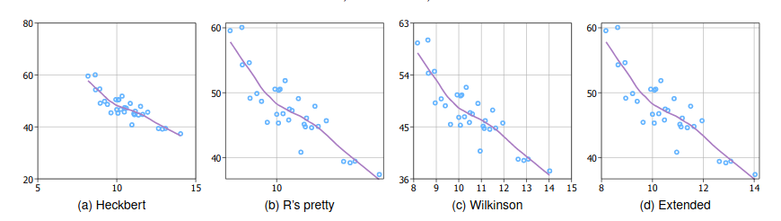

# labeling 

This package contains functions which provide a range of axis labeling algorithms, most notably the "extended" algorithm described in Talbot et al.'s [An Extension of Wilkinson’s Algorithm for Positioning Tick Labels on Axes](http://vis.stanford.edu/files/2010-TickLabels-InfoVis.pdf). They are used in [ggplot2](https://ggplot2.tidyverse.org/), through the [scales](https://scales.r-lib.org/) package. 

For implementation details, see `/cran-package/R/labeling.R`. For instructions and usage examples, see `labeling-manual.pdf`. For complaints and bugs, send me a message to the mantainer [email](https://cran.r-project.org/web/packages/labeling/) or file a Github issue. 
